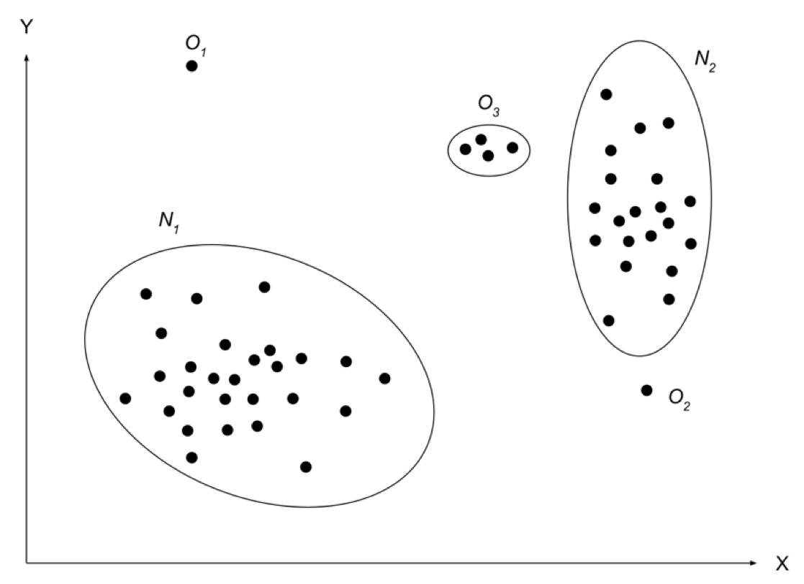
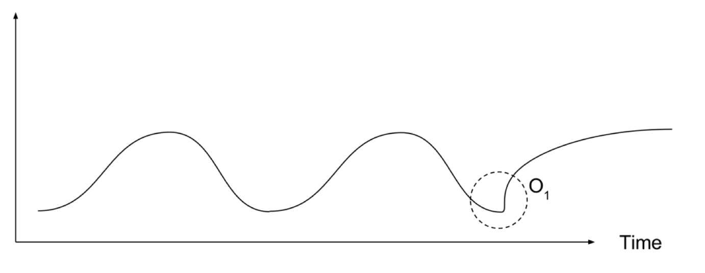
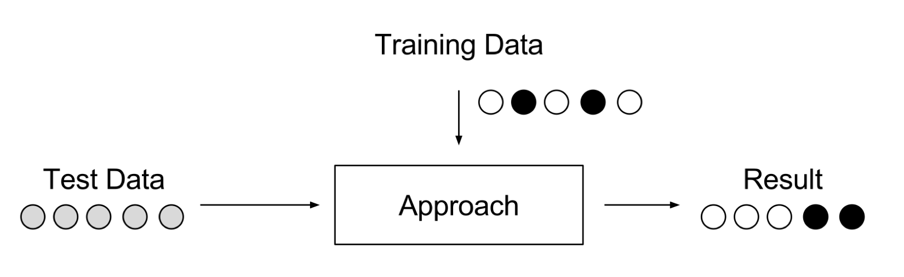
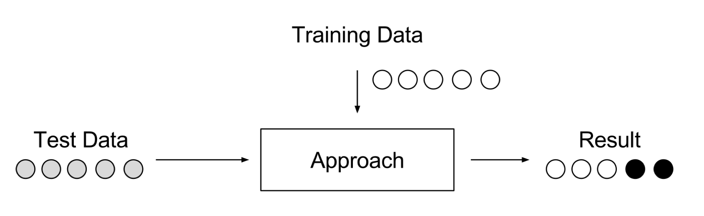
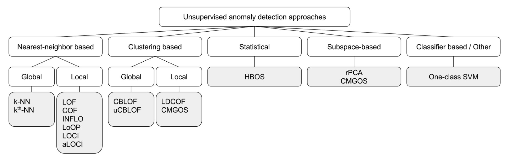

## Prologue

This article is inspired by the research done during studies in the
university.
Goal of this article is to act as a note and reminder that finding anomalies is not a trivial task (currently).

## Introduction

Anomaly detection refers to the task of finding observations that do not conform to the normal, expected behaviour.
These observations can be named as anomalies, outliers, novelty, exceptions, surprises in different application domains.
The most popular terms that occur most often in literature are anomalies and outliers.
Anomaly detection is an actual problem in various areas, such as:

- Intrusion detection
- Fraud detection
- Industrial damage detection
- Medical and public health
- Image processing
- Anomaly detection in text data
- Sensor networks and other domains

## What is anomaly

Unfortunately, there is no clear definition of the anomaly that's why I've chosen the following one --- anomalies are patterns in the data that do not conform to a well-defined notion of normal behaviour .
We can illustrate anomalies in a simple two-dimensional space (Figure 1).

N₁ and N₂ are regions with normal data because the majority of observations are in these areas.
Points that are far away from normal areas, like points O₁, O₂ and region O₃ are anomalies.
Anomalies in the data can occur for different reasons.
Malicious activity, credit-card fraud, intrusions, system breakdowns, etc.
These anomalies are attractive to the data analyst.
Therefore, anomaly detection is an important process and is considered as an advantage in various decision-making systems.

## Types of anomalies

Anomalies can be classified into the following three categories:

- *Point Anomalies*.
If one object can be observed against other objects as anomaly, it is a point anomaly.
This is the simplest anomaly category and a lot of researches include them.
Taking into consideration example represented in Figure 1 points O₁ and O₂ are point anomalies
- *Contextual Anomalies*.
If object is anomalous in some defined context.
Only in this case it is contextual anomaly (also known as conditional anomaly .
In Figure 2 can be seen periodic context.
In this case point O₁ is anomaly, because it differs from periodic context
- *Collective Anomalies*.
If some linked objects can be observed against other objects as anomaly.
Individual object can't be anomalous in this case, only collection of objects.

We need to understand, that these anomalies can be connected.
Point anomaly could become contextual if we apply context to it.
Or point anomalies could become collective ones, if we join multiple point anomalies together.

On the abstract level detection of the anomalies seems like a simple task.
But this task can be very challenging. Here are some challenges bellow:

- Defining normal regions is very difficult.
In many cases boundaries between anomalies and normal data are not precise.
In this case, normal observations could be considered as anomalies and vice-versa
- If action is malicious, like fraud, it is considered as anomaly.
Very often attackers try to adapt their actions to the normal behaviour.
And again, task to identify anomalies in this case is not so simple
- What is considered normal today can be not normal in the future.
Most of the business systems change in time under the influence of the various factors
- Approaches for anomaly detection in one field more often cannot be used in the other one.
They will be ineffective in most cases
- Training and validation data availability for model training is a big problem

## Let's play

Bellow I will give some dataset examples. Your goal is to scroll slowly
(example by example) and try to determine anomalies by eye.



Figure 3. Little game

As you see, it is not trivial to determine anomalies in some cases "by eye".
Even if you will apply some statistical techniques, still it is not trivial.
So, where to look and what to do?

## Anomaly detection approaches overview

Approaches that can be used to find anomalies fall into following categories :

*Supervised Anomaly Detection.*
A setup where the data is labelled in training and test data sets; when simple classifier can be trained, and applied.
This case is like traditional pattern recognition with the exception of classes which are in most cases strongly unbalanced.
Not all classification approaches suit for this task.
For example, some types of decision trees cannot deal well with unbalanced data.
[Support Vector Machines (SVM)](https://en.wikipedia.org/wiki/Support_vector_machine) or [Artificial Neural Networks (ANN)](https://en.wikipedia.org/wiki/Artificial_neural_network) should perform better.
However, this setup is not relevant, because we need to know all anomalies and label data correctly.
For many cases anomalies are not known in advance or may occur as novelties during the test phase.

*Semi-supervised Anomaly Detection.*
In the beginning, when we do not have any knowledge, we gather it from training results.
This setup also uses training and test datasets, where only training data consists of normal data without any anomalies.
The idea is, that a model of the normal class is already taught and anomalies can be detected by deviating from learned model.
This approach is also known as "one-class" classification.
Well-known approaches are One-class SVMs and [autoencoders](https://en.wikipedia.org/wiki/Autoencoder).
In general, any density estimation approach can be applied to model the probability density function of the normal classes, such as [Gaussian Mixture](https://en.wikipedia.org/wiki/Mixture_model#Gaussian_mixture_model) approaches or [Kernel Density Estimation](https://en.wikipedia.org/wiki/Kernel_density_estimation).

*Unsupervised Anomaly Detection.*
A setup, when we do not know, what is normal in the data and what is not.
It is the most flexible configuration which does not require any labels.
There is also no difference between a training and a test dataset.
The concept is that an unsupervised anomaly detection approaches score the data solely based on natural features of the dataset.
Typically, distances or densities are used to give an evaluation what is normal and what is an outlier.
The visual representation can be found in Figure 6.

Most approaches as output will give score or label.
The difference between scoring and labelling is in flexibility.
Using scoring techniques analyst can choose values which are more suitable for the problem area.
After that, he can use the threshold value to select anomalies or just choose the top ones.
Labelling is a classification.
No approaches by now can be used in all domains with the same success without research about the domain and feature extraction.
Most of the unsupervised anomaly detection approaches are shown in Figure 7.

## Real life is dynamic

If the behaviour of observable objects in defined environment change in time, this environment can be considered as a dynamic environment.

A dynamic environment, such as a production process, a communication network, highway traffic, etc., may contain a huge amount of information, changing with time, which is a valuable resource for understanding the general behaviour of the environment, discovering the regularities and anomalies currently happening in the environment, controlling an evolution process, and intelligent modelling or managing the environment .

For example: an internet shop that is experiencing growth.
Traffic and transactions volume change.
What was normal before will not be now, and this shift only can be considered as an anomaly.
This is one of the challenges identified earlier.
Another example is a system that analyses customer behaviour.
Customers may be classified initially. But customers also can move for some reason from one class to another in time.
Systems evolve over time as the software is updated or as behaviour is changed.
Firstly, for efficient detection of anomalies, systems for continuous learning are needed.
Secondly, to detect anomalies in the early stages, one cannot wait for the metric to be clearly beyond the bounds.
Early detection needs the ability to detect subtle changes in patterns that are not apparent.
Besides, since the anomalies are by nature unexpected, an efficient detection system should be able to determine whether the anomalous events are new without relying on pre-programmed thresholds.

Detecting anomalies in the dynamic environment seems like a tough task.
The biggest problem that can be faced is that in most companies there will be no data for learning.
Most of the approaches to use in such case should be unsupervised.

## Possible solutions

Solutions that currently are progressive and give hope include Neural Networks (NN), some of them in combination with statistical approaches.

Popular NN used now for time-series is Long-Short Term Memory (LSTM)  ---  it gained popularity in the Deep Learning field because of their possibility to remember long running dependencies.

Another one interesting kind of network which is new, not mentioned a lot, is a Hierarchical Temporal Memory (HTM)  ---  it is a neural network that is based on researches in the neuro-science which also has ability to learn and remember long running dependencies.
Will tell a little bit more about it.

### Hierarchical Temporal Memory (HTM)

HTM is an unsupervised to semi-supervised online machine learning method developed by Jeff Hawkins and Dileep George of Numenta, Inc.
It is a technology that aims to capture the structural and algorithmic properties of the neocortex.
HTM is a theory of the neocortex and has few similar brain structures.
The neocortex comprises about 75% of volume of the human brain, and it is the core of most of what we think of as intelligence.
HTM is a biological theory, meaning it is derived from neuroanatomy and neurophysiology and explains how the biological neocortex works.
They say, that HTM theory is "biologically constrained" as opposite to "biologically inspired"  ---  term used in machine learning.

The HTM learning method is designed to work with the dynamic environment as sensor and motor data.
Sensor input can change depending on different obstacles as metrics from a server.
Instead, the input data may change, because a sensor is moving the same as human being eyes are watching at the static picture.

HTM systems learn online. When there is any change in input data, the memory of HTM system is updated.
There is a standard machine learning approach, like splitting data in test and training datasets, and learn network to achieve defined accuracy level.
And the questions come out: "If there no labelling, how does it know, that it is working correctly?
How can it correct its behaviour?".
At each point in time, HTM makes a prediction of what it expects will happen next.
In other words, HTM builds a predictive model of the world.
Then, the prediction is compared to what happened and this result is a basis for learning.
As a classical machine learning methods, it tries to minimise the error of the predictions.
HTM learns continuously.
This is an essential quality for a biological organism to survive.
HTM has been built around this idea, that intelligent systems need to learn continuously as biological organisms.
There will be applications, where systems do not need to learn online, but these are not the norm, but exceptions.
HTM is pretending to be a universal learning method for any task, which has temporal behaviour.
More details can be found on their website, referring to the following source .

## Invented new approach! How to prove that it works?

Okay, you invented new approach to solve this problem. How to prove, that your approach works and is better than others?

Many researchers, investigating unsupervised anomaly detection methods, encounter the problem  ---  there is no defined framework to evaluate their performance.
Many scientists only make theoretical assumptions.
Currently, some attempts to create such framework appeared.

Markus Goldstein and Seiichi Uchida in their work  propose, how evaluation should be done for anomaly detection approaches.
But their assessment methodology is oriented on methods that work with tabular data.

On the 14th International Conference on Machine Learning and Applications (IEEE ICMLA) 2015 Alexander Lavin and Subutai Ahmad proposed their methodology for real-time anomaly detection procedures evaluation  ---  the Numenta Anomaly Benchmark (NAB).

### NAB

This is the first benchmark for anomaly detection procedures in time series.
[NAB is an open-source framework](https://github.com/numenta/NAB), that aims to evaluate real-time anomaly detection procedures through the controlled and repeatable environment.
NAB data corpus consists of 58 real datasets, where anomaly windows are labelled.
Each file consists of 2,000 to 22,000 timestamps with data aggregated in 5-minute intervals.
It has an overall of 365,551 points.
These datasets are synthetic and real-world:

- IT metrics
- social media chatter
- industrial machine sensors

Scoring mechanism has defined anomaly detection windows to measure early detection.
It rewards algorithms that:

- detect all present anomalies
- detect them as soon as possible
- trigger few false-positives
- work with real-time data
- are automated across all datasets

It uses application profiles to gauge performance for different scenarios.
All examples of datasets in "Let's play" section are from this benchmark.

## Conclusion

Many companies who's main product is some kind of database will come up with this topic on the conferences and will show you how you can find
anomalies with their tools.
But problem is, that shown approach is good only for **that specific dataset and use case**.
Keep that always in mind.

Remember that finding anomalies require appropriate definitions from the analyst.
There are different types of anomalies.
There are different methods to find specific types of anomalies.
Always try to narrow your problem.
And test your approach using available benchmarks or some datasets (if available) for your problem.

To read more on this topic, you can find references to the different articles bellow.

May the force be with you.

## References

 Chandola, V., Banerjee, A. & Kumar, V., 2009. Anomaly Detection: A Survey. ACM Computing Surveys, July. 41(3).

 Song, X., Wu, M. & Jermaine, C., 2007. Conditional Anomaly Detection. IEEE Transactions on Knowledge and Data Engineering, 26 March, 19(5), pp. 631--645.

 Kawano, H., Nishio, S., Han, J. & Hasegawa, T., 1994. How does knowledge discovery cooperate with active database techniques in controlling dynamic environment?. Athens, Greece, Springer-Verlag Berlin Heidelberg.

 Hawkins, J., Ahmad, S. & Lavin, A., 2016. Biological and Machine Intelligence. [Available here](http://bit.ly/2qJzvjO).

 Goldstein, M. & Uchida, S., 2016. A Comparative Evaluation of Unsupervised Anomaly Detection Algorithms for Multivariate Data. PLoS ONE, 11(4), p. 31.

 Lavin, A. & Ahmad, S., 2015. Evaluating Real-time Anomaly Detection Algorithms  ---  the Numenta Anomaly Benchmark. Miami, IEEE.
