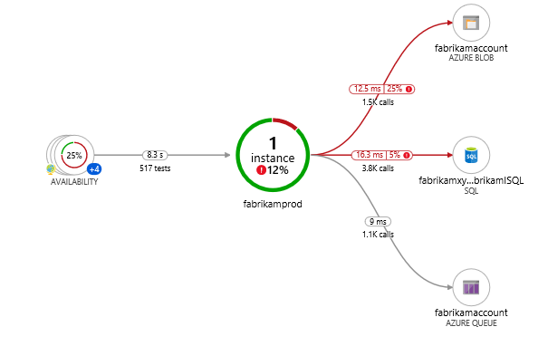

## TL;DR

Use `WEBSITE_CLOUD_ROLENAME` environment variable ([source](https://github.com/Azure/azure-webjobs-sdk/blob/3f4ec78be9f43bb041937425ced00b341883aa42/src/Microsoft.Azure.WebJobs.Logging.ApplicationInsights/Initializers/WebJobsRoleEnvironmentTelmetryInitializer.cs)).

## Longer story

In Azure, recommended way to collect logs from apps is to use [Application Insights](https://docs.microsoft.com/en-us/azure/azure-monitor/app/app-insights-overview) (which is pretty cool by the way).
You even can construct the [application maps](https://docs.microsoft.com/en-us/azure/azure-monitor/app/app-map?tabs=net) to see how they communicate with each other.

To create such map you will instruct your applications to use the same Application Insights Instance.
But how to segregate logs to understand that they are coming from different apps?

If you are using some flavour of the Application Insights SDK, then this can be achieved by setting the name of the app in the `APPLICATIONINSIGHTS_ROLE_NAME` environment variable or by following [the instruction for the SDK](https://docs.microsoft.com/en-us/azure/azure-monitor/app/app-map?tabs=python#set-or-override-cloud-role-name).

## Is it different for Azure Functions?

Yes.
Don't ask me why, this is not the case for Azure Functions.
Setting this variable will not give you the desired result.

You will see one name for all your function which is "Web" for some reason.

## We need to go deeper

What do we know?

We know that Azure is Microsoft thing.
Microsoft loves .NET.
What framework is there to build web apps?
ASP.NET!
What is the one popular service to run the apps in the Azure?
Azure App Service!

Let's see what [environment variables Azure App Services have](https://docs.microsoft.com/en-us/azure/app-service/reference-app-settings?tabs=kudu%2Cdotnet#app-environment).

Okay, they have something called `WEBSITE_SITE_NAME`.
Unfortunately it's read-only.
Nice thing though, it seems like all environment variables start with `WEBSITE_*` prefix.

How Azure Function Hosts are built?
Let's take a look into [Azure/azure-functions-host](https://github.com/Azure/azure-functions-host) repo.

But before that... Azure Functions are activated by triggers and there is such thing called [extension bundles](https://docs.microsoft.com/en-us/azure/azure-functions/functions-bindings-register#extension-bundles).
Never was interested to go that deep, but let's see what host bundles can be found in that repo and try to find a clue within them.
There is [`extensionrequirements.json`](https://github.com/Azure/azure-functions-host/blob/ebe1aafa9bf01ed56202b21a1a47a1897d2cebf9/src/WebJobs.Script/extensionrequirements.json) file which tells what WebJobs to add...
WebJobs?
What is this?
Let's search for "azure webjobs sdk".

The first link would lead to [Azure/azure-webjobs-sdk](https://github.com/Azure/azure-webjobs-sdk).
Looking into [WebJobs SDK documentation](https://docs.microsoft.com/en-us/azure/app-service/webjobs-sdk-how-to) we can see that they are even using the same configuration files as for Azure Functions, e.g. `host.json` and `local.settings.json`.

So Azure Functions are actually App Services baked by WebJobs SDK and some runtime spice.
Nice.
Back to the business.

Can we find in the repo something by the `WEBSITE_*` keyword?
Yes!
Found the [following commit](https://github.com/Azure/azure-webjobs-sdk/commit/99f2fc90fec941145b30a24ed04ee140f0cd8ecc) which adds `WEBSITE_CLOUD_ROLENAME` environment variable.
It resolves [issue #2653](https://github.com/Azure/azure-webjobs-sdk/issues/2635) for Azure Static Web Apps ([issue #204](https://github.com/Azure/static-web-apps/issues/204)) to resolve that particular issue with naming of the apps in Application Insights.

Let's [open that file on the line with the change](https://github.com/Azure/azure-webjobs-sdk/blob/3f4ec78be9f43bb041937425ced00b341883aa42/src/Microsoft.Azure.WebJobs.Logging.ApplicationInsights/Initializers/WebJobsRoleEnvironmentTelmetryInitializer.cs).
We see the variable `WEBSITE_CLOUD_ROLENAME`.

So here it is!

After adding it as part of the Azure Functions environment variables Application Insights started to name functions as I wanted.
