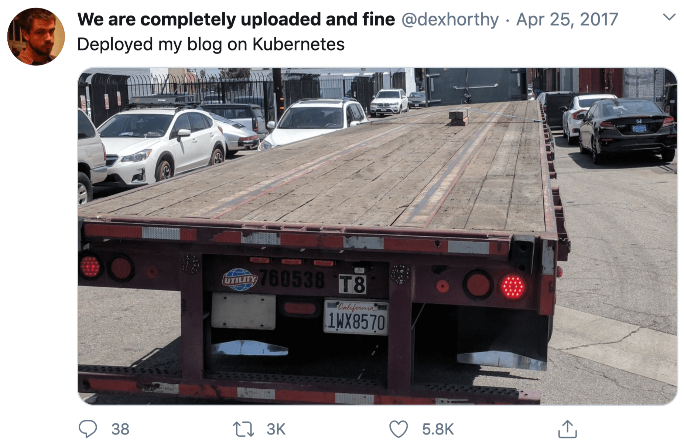

I follow minimalism thinking for some long period of time.
It helps me to navigate in this world, make choices, grow and expand the area of my freedom.

I would like to share how minimalism influences me as an engineer and my life in general.
How thinking works in my head.

## Definition

Although minimalism has different facets we need some definition as a starting point.
Here is a definition from Cambridge Dictionary:

> Minimalism --- a style in art, design, and theatre that uses the smallest range of materials and colours possible, and only very simple shapes or forms.[^1]

I would like you to focus on the following parts:

- "uses the smallest range of materials"
- "uses [..] very simple shapes and forms"

From this we can make an assumption that minimalism is about constraints which lead to simplicity.

## Minimalism in Engineering

Creating simple solutions requires a lot of thought power and cognitive resources.
You think a lot, you compare, rewrite and redesign.
Continuous improvement and analysis of problems lead to simplicity.
It's a journey and not an easy one.

Minimalism is not about savings either.
Yes, money savings are usually one of the positive side effects but not the end goal.

For example, imagine that you are thinking of starting a blog:

- Why do you want to start a blog? To share something? To capture something?
- Would you use some blogging platform?
- Would you run your own blog on WordPress and host it?
- Or you would you just use some static website generator and host it on Firebase or Netlify?

This is already a lot of questions and thoughts.
This how the thought process might look like:

- I want to share my thoughts with others and take notes that might help me in the future
- I don't want to use blogging platform because they are injecting ads and hide me behind the paywall
- I want to be an owner of my content
- WordPress is cool, but I don't want to run my own server and database, think about backups, etc.
- Writing markdown is enough for me; no database; looks like an option
- Does *this* tool creates a website how I would like it to see? Yes --- Perfect!
- ...

The initial statement "I want to run a blog" is too broad.
Would it be a solution to run it on a Kubernetes cluster?

Maybe.
Is it worth it?
The scope of the problem should be narrowed by defining constraints.

Constraints that were found during the thinking process about different aspects can change the scope of a solution drastically.
Amount and type of questions asked are based on experience and knowledge in the different areas.

> Why do people think simple solutions are cheap?
> Simple is hard.
> Simple requires a lot of knowledge, experience and experts.
> Simple is expensive.[^2]
>
> --- Jaana Dogan

Simple is hard.
Simple solutions are born in sweat.

Solutions delivered without constraints can be delivered fast.
And usually, they fail because in this case solutions are:

1. Created from what first came into the mind which... might be not what was originally expected
2. Designed very flexible which will make solution unusable

> Find and define constraints before you start the search for a solution.

- Monolith or Microservices?
- Function or method in a class?
- Cloud or Self-hosted?
- Is sharding needed?
- Scale horizontally or vertically?
- etc.

Answers will depend on many things.
Define constraints and define them strictly.

Less components involved --- less points of failures.
Simpler logic --- the result is clear and easier to debug.
It's boring, but boring solutions are worth the investment for the future.

Next time designing a solution, try to follow "Five whys"[^5] principle.

## Minimalism in Life

Individuals with minimalism thinking are very responsible and conscious.
They make choices wisely.
They have a system of values.
They know what quality is.
They tell "no" more than "yes".
They respect themselves and others.
They talk less and do more.

> Minimalism is a tool to rid yourself of life’s excess in favor of focusing on what’s important—so you can find happiness, fulfillment, and freedom.[^4]

They focus on what is important to them.
Many of us want to be financially independent.
To make this possible you need to make choices and define constraints.
For example: I'm not going to upgrade my phone each year and dine out every day.

> Practicing minimalism is the most liberating thing I've ever done.
> It put me in position of financial independence and gave me a sense of self detached from physical possessions and status symbols.[^3]
>
> --- Kelsey Hightower

Less is more.
You start to focus on what is really important to you and not others.
What is important to you?
Is it 500K followers or your family?
Do you want to eat that junk food or stay healthy and fit?
Do you want to be known for your high quality work or just sell to make money?

> Minimalism is a tool that can assist you in finding freedom.
> Freedom from fear. Freedom from worry.
> Freedom from overwhelm.
> Freedom from guilt.
> Freedom from depression.
> Freedom from the trappings of the consumer culture we’ve built our lives around.
> Real freedom.[^4]

Minimalism is not about limiting yourself, it's about listening to yourself and **following your real needs**.
Each human life is different and approach to minimalism is too.
That's why copy-pasting somebody will not work here.
We have different priorities, different views and thoughts.
But finding **what is really important to you** is worth the journey.

[^1]: [Minimalism --- definition](https://dictionary.cambridge.org/dictionary/english/minimalism)
[^2]: [Tweet](https://twitter.com/rakyll/status/1131300939430735874)
[^3]: [Tweet](https://twitter.com/kelseyhightower/status/1271092848071331842)
[^4]: [The Minimalists Blog](https://www.theminimalists.com/minimalism/)
[^5]: [Five whys](https://en.wikipedia.org/wiki/Five_whys)
