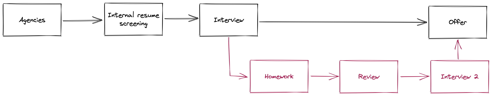

In 2018, I gave a talk at [DACHfest 2018 called "Interview Process From Scratch"](https://www.youtube.com/watch?v=1u5griKyxzc).
This post is based on that talk.
I decided to finally put it in written form because I had learned a lot during that time and wanted to preserve that knowledge.
As the saying goes, history often repeats itself, so it's better to have a written record of what you've done previously and why, rather than reinventing the wheel.

## Introduction

In this post, I want to share my experience of being involved in a large interview/hiring process that spanned over five months and involved over 200 engineers.
All of this happened in 2018.
As someone who has been through [various interview processes]() myself, I had my own opinions about what a good interview process should look like from the interviewee perspective.
But now, I found myself in the position of creating the process, conducting interviews, and assessing candidates from the other side.

This experience led me to question what a good interview process should actually entail.
I want to encourage you to think about your company interview process --- do you truly believe it's effective and well-structured?
Or do you simply go through the motions without critically evaluating its strengths and weaknesses?

If, after reading this post, you find yourself questioning the effectiveness of your current interview process, then I believe I have accomplished my goal.

One thing to note is that this is not a scientific research study --- it is simply my personal experience.
As such, some of the practices and approaches I mention may not be suitable for your company environment.

## Story time

Once upon a time, a group of engineers was asked, "Who wants to help with interviews?" and only one hand went up --- mine.
Soon, the situation felt something like the image below:


Here are some facts about the hiring process I was involved in:

- More than 200 interviews were conducted in total.
- Over 120 of those interviews were conducted by me alone.
- On average, I conducted 12 interviews per week, with some days involving 4-5 interviews.
- Candidates from around the world were interviewed.
- All interviews were conducted online.

This process was incredibly intensive and challenging, but why did it have to be that way?
Essentially, our company had a new project on the horizon and had just opened a new office.
As a result, a large workforce was required, and the company had committed to providing 100 engineers before the end of the year.

## Interview Process. The beginning

Initially, our interview process was quite simple:


We relied on recruiting agencies to provide us with candidates that matched our profile description, conducted interviews, and sent out offers if the interview was successful.
The goal of the interview was to validate that the candidate had the necessary knowledge by asking various questions in a non-structured way.
The entire interview lasted one hour.
This process was very straightforward.

However, we quickly learned that this approach had some flaws:

- The process only works well if the agencies invite candidates who are a true match, which is unlikely to be the case all the time.
- Since the interview process was so short and sweet, candidates were surprised when they received immediate job offers, and some even thought something was amiss.
- Because the interview was so brief, it was difficult to tell if a candidate was a "cheater," which I'll explain more about later.
- I personally started to experience burnout from conducting so many interviews.

In short, while this process might have looked good on paper, it was fraught with challenges in practice.

## Interview Process: In the Middle

After identifying some problems with the initial interview process, I started making changes.
The first crucial point to fix was my burnout.


Since I didn't have the capacity to make all the necessary changes, I decided to invite other team members to conduct interviews.
This led to two important changes.

First, we created a list of topics/questions (framework) that should be asked during interviews, along with answer examples.
This framework was shared with everyone on the team.

Second, we started to classify candidates into the following categories:

- :cucumber: Junior
- :hot_pepper: Middle
- :tomato: Senior

We used these emojis in our Slack channel to represent the categories.

So, how did we classify candidates?

We considered two main characteristics:

- **Overall technical impression:** What does this person represent as a specialist? How broad is their knowledge?
What technologies have they used?
How do they work? etc.
For Junior candidates, we expected them to be fluent in terminology (i.e., know something).
Middle candidates would have depth of knowledge, meaning if they told us what technologies they used and we asked specific questions, we would expect to hear an answer.
Senior candidates know how to build systems, see from what parts a system should consist of, and have knowledge in different domains.
- **Self-sufficiency:** Junior candidates need help from teammates, while Middle candidates can act independently.
Senior candidates are independent and can guide teammates.

At this point, we had made progress with the following:

- The questions framework helped to scale the interview process and provided a consistent measurement tool for all interviewers.
- The classification of candidates helped us understand who we were interviewing and how our pipeline looked.

However, we were still getting a lot of candidates who did not meet our expectations.

## Interview process. In the middle 2

We made further changes to our interview process as follows:


In addition to agencies, interviews, and offers, we added an internal resume screening step.
This helped us to reduce the number of candidates who were not a good fit for us, and also improved the input we received from agencies through feedback backpropagation.

We extended our questions framework to include Code Review questions and Open-Ended Questions.
These were introduced to help us identify candidates who may be cheaters or who talk a good game but do not have practical skills.
Code Review questions start with "Have you ever done a code review?" and lead to a Code Review exercise, such as the following:

```java
public void increaseValue(int amount, boolean isCredit) {
  if (isCredit) {
    this.creditAmount += amount;
  } else {
    this.debitAmount += amount;
  }
}
```

We then ask, "What problems do you see here?" and listen to the candidate's response.
Open-Ended Questions, on the other hand, are questions without a correct answer.
They help us to understand how the candidate thinks.
Examples of Open-Ended Questions include, "What do you love/hate about `technology`?" and "You've implemented a feature. How will you make sure that it works as expected?"

As a result of these changes, we have seen fewer false positives with candidates, and we are better able to recognize cheaters.
However, we still struggle to identify Senior candidates within the one-hour interview timeframe.
As mentioned previously, we classify Senior candidates based on their T-knowledge and architectural intuition, which can be difficult to assess in such a short time.

## Interview process. Current state

We have further refined our interview process to reduce false positives and better identify Senior candidates.

The process now looks like this:



We have added a new branch for Senior candidates.
In addition to the standard interview, we now give them a homework assignment.

The homework should be simple and related to their domain, with mandatory and optional requirements specified.
It should not be an algorithmic quiz.

The candidate sets the deadline for the homework to be completed, as we want them to feel comfortable and respected.

If we like the candidate's work on the homework, we invite them for a second interview to discuss it.
The second interview focuses solely on the homework assignment.

Providing feedback is crucial.
We always provided feedback on the homework assignment, as we wanted to respect the candidate's time and effort.
We recognized that not providing feedback is a huge red flag for candidates.
As such, we made it a point to always provide feedback, even if the candidate is not a good fit for the position.

Somebody mentioned Live Coding Interviews?


In my opinion, live coding interviews should be dead.
Based on my experience, they don't reveal much about a candidate's abilities.
Why?

Firstly, it is difficult to simultaneously think about the problem, code a solution, and explain the thought process to the interviewer.
Many developers are introverts and prefer to focus on the problem-solving aspect before discussing and explaining their approach.

Secondly, engineers spend more time reading code than writing it.
Therefore, it is more important to evaluate how well a candidate can read and understand other people's code.

Additionally, every individual is unique, with different strengths and weaknesses.
One person may be able to solve a particular problem quickly because it is familiar to them, while another may require more time or prefer to write things down.
This complexity makes it difficult or even unfair to evaluate candidates solely through live coding interviews, which require specialized training and preparation for each company's unique style.

Therefore, live coding interviews may not be the safest way to assess a candidate's suitability for the position.
If you are looking for an engineer, it may be more effective to evaluate their work experience and technical skills through other means.

Some people argue that live coding interviews test the candidate's ability to collaborate.
However, in most cases, these interviews involve one person who codes and another one who staring at the screen, asks questions without contributing to the problem-solving process.

Overall, I recommend considering other evaluation methods, such as code reviews or take-home assignments, that allow candidates to showcase their abilities in a more realistic environment.

## Summarizing the Interview Process

To ensure a successful hiring process, consider the following steps:

- Define a list of requirements and create a profile or avatar for your ideal candidate.
- Provide agencies with clear and relevant information to avoid receiving unqualified candidates.
- Inform the candidate about the hiring process and set clear expectations to respect their time.
- Consider giving a homework assignment for senior candidates to assess their skills.
- Avoid live coding interviews, as they can be challenging for introvert candidates and may not accurately reflect candidates abilities.

## Message to Candidates

- Know the language in which you will be speaking during the interview.
- Check that your hardware and software are working before the interview.
- Refresh some fundamental knowledge.
- Speak up. Interviewers don't have the ability to read your mind.

Let's talk a little bit about resumes.
Do not include personal information such as:

- Birthday
- Marital status
- Gender

Another thing not to include is a list of technologies.
Why?
Usually, it doesn't matter what you used but what you accomplished.
Tell them what you did, add numbers, and show how you can be helpful.
What do you want them to see?

The risk of including a list of technologies is that it may look impressive to you, but the reviewer might look at it and think that there are too many "legacy" technologies and not be interested.
In my opinion, a list of technologies hides your potential as an engineer.
Usually, it doesn't matter in what language or framework you implemented something.
If the company lists their tech stack, only include technologies from that stack if you want to include it.

Make your resume interesting!
How many resumes do recruiters review?
A lot.
If there is something that stands out, it's like a breath of fresh air.
Take this opportunity to make your resume visually appealing by adding colors or other design elements.
We are in the 21st century, after all, and all resumes are viewed on tablets, phones, and computers nowadays.
Ink is not a problem.

## Message to Interviewers

Your main job is to listen and stay focused.
Avoid distractions and stay present during the interview.
Remember that it is disrespectful to go away in your thoughts or use your phone during the interview, as you may miss valuable information.

Help your candidates if they forget a technology name or word, as they may be under stress.
Make them feel safe and comfortable during the interview process.

Avoid bombarding candidates with questions.
Instead, aim for natural conversation and tie in your questions with the flow of the discussion.

Stay calm and avoid being aggressive.
Slow down and give candidates space to answer questions fully.

Don't ask candidates to introduce themselves if you have already received their resume.
This can be a red flag for some candidates who may assume you haven't read their resume.

Lastly, avoid using Skype for interviews.

## Summary

Creating interview process is hard.
It can take different shapes and forms depending on the company needs.

Interviewing is a skill that should be developed.
Without proper support asking engineers to participate in interviews will just kill them.
If you want to scale interview process: create framework, teach.

It is important to respect the candidates and keep your mind cold during the interviews.
Interview is not a place to show the candidates how smart you are, it is a place to understand candidates, collect as much information as possible about them.
Listen carefully and with respect, help them out when needed.
