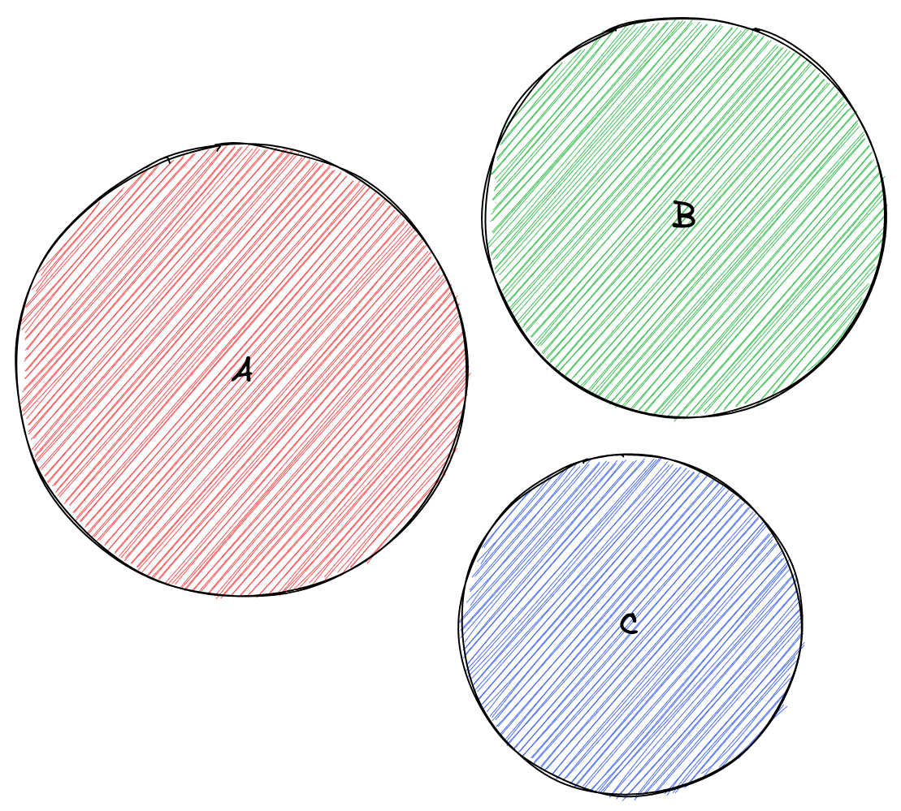
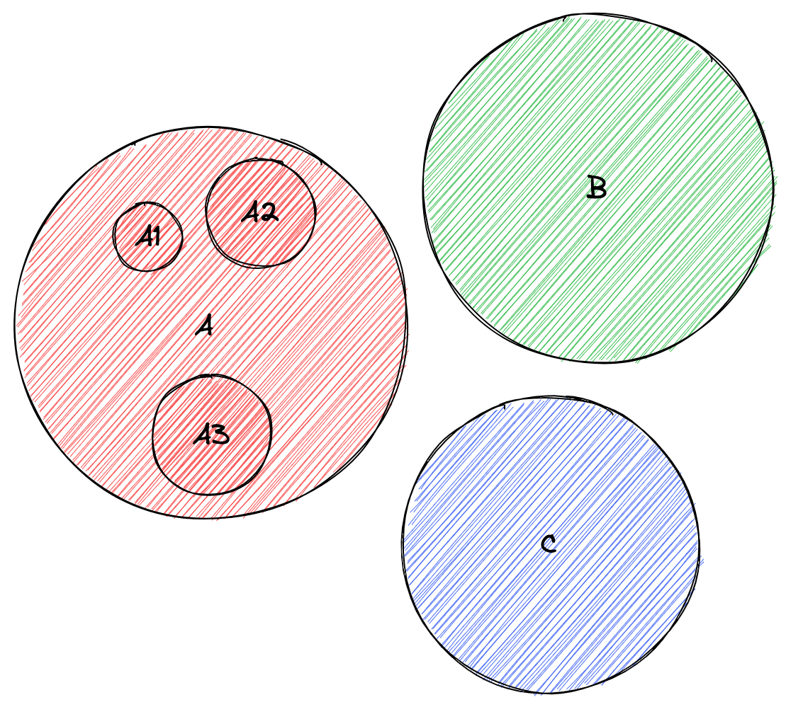
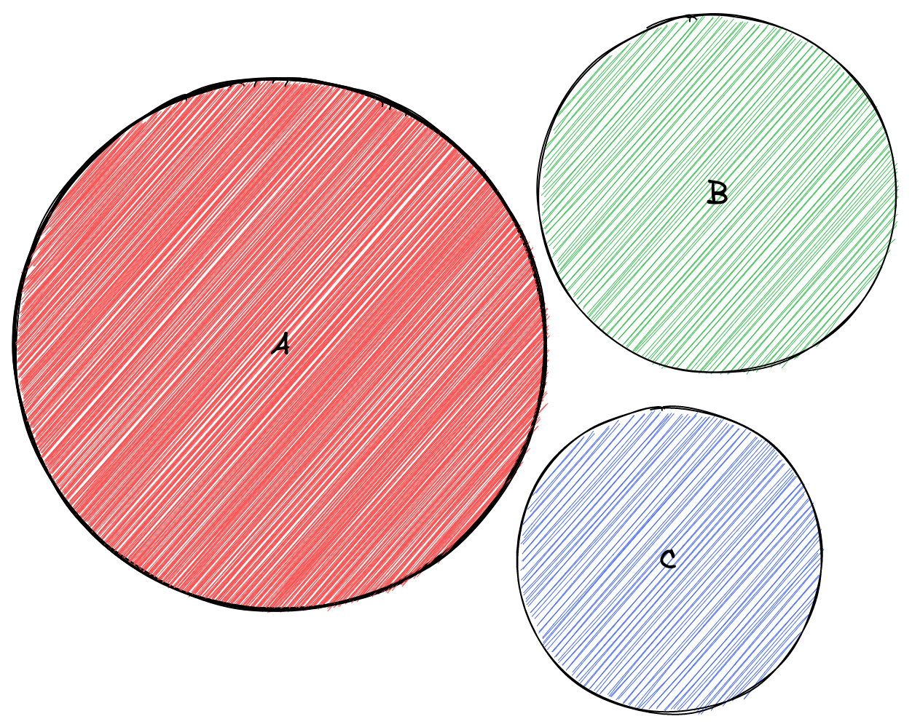
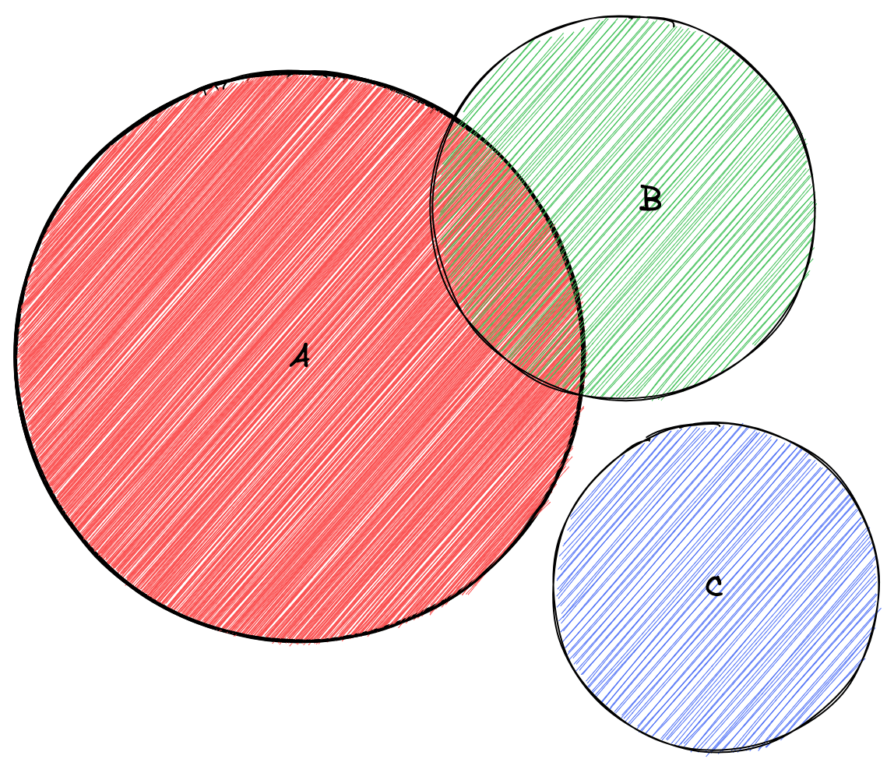
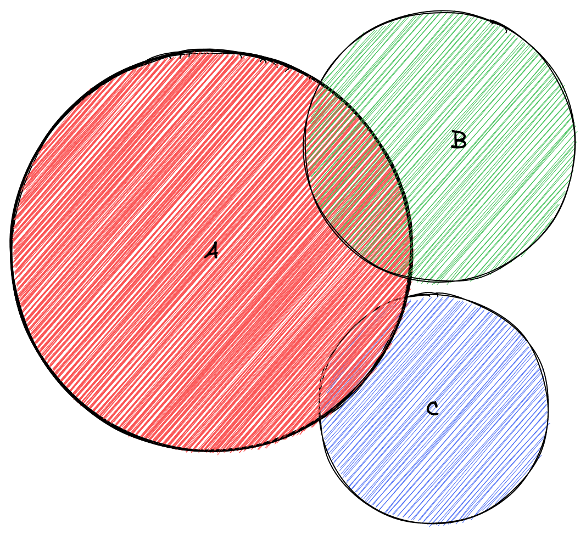
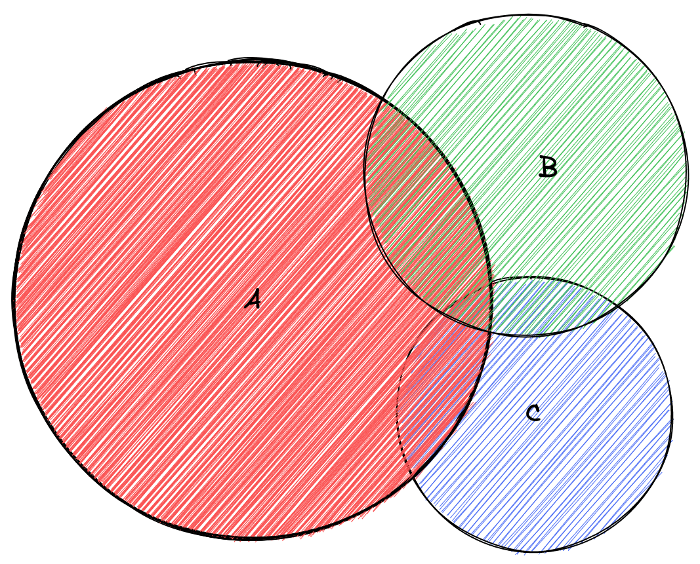
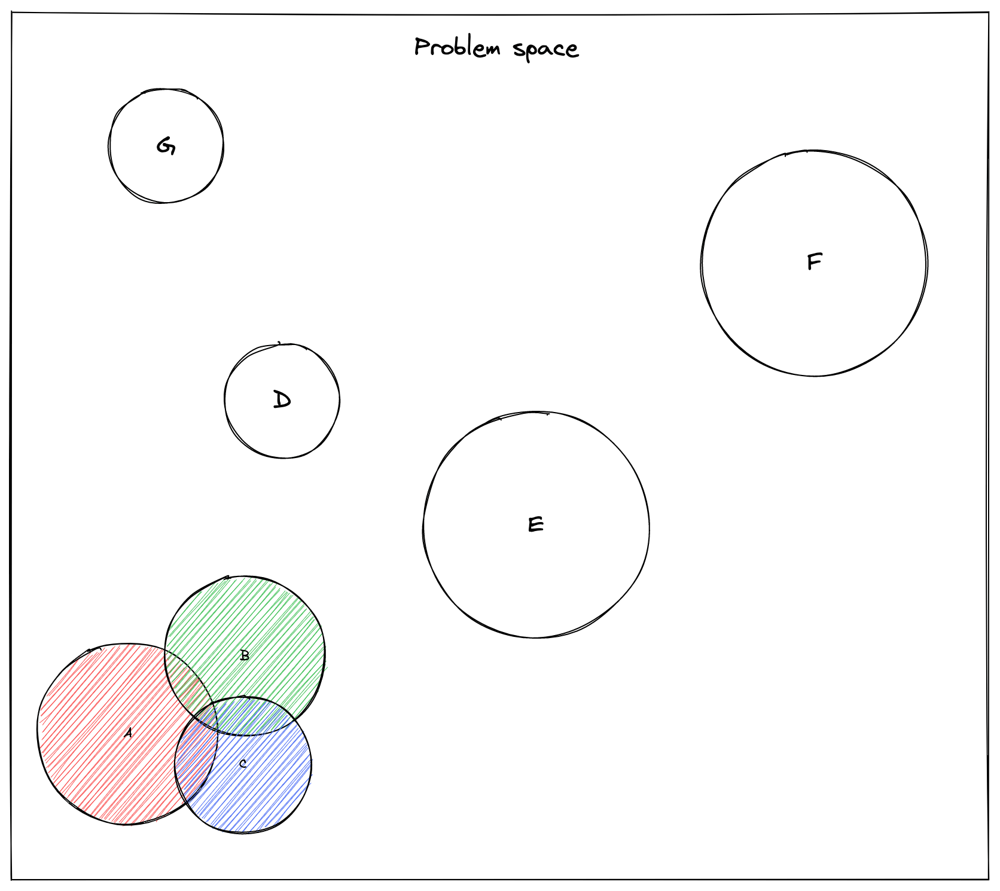
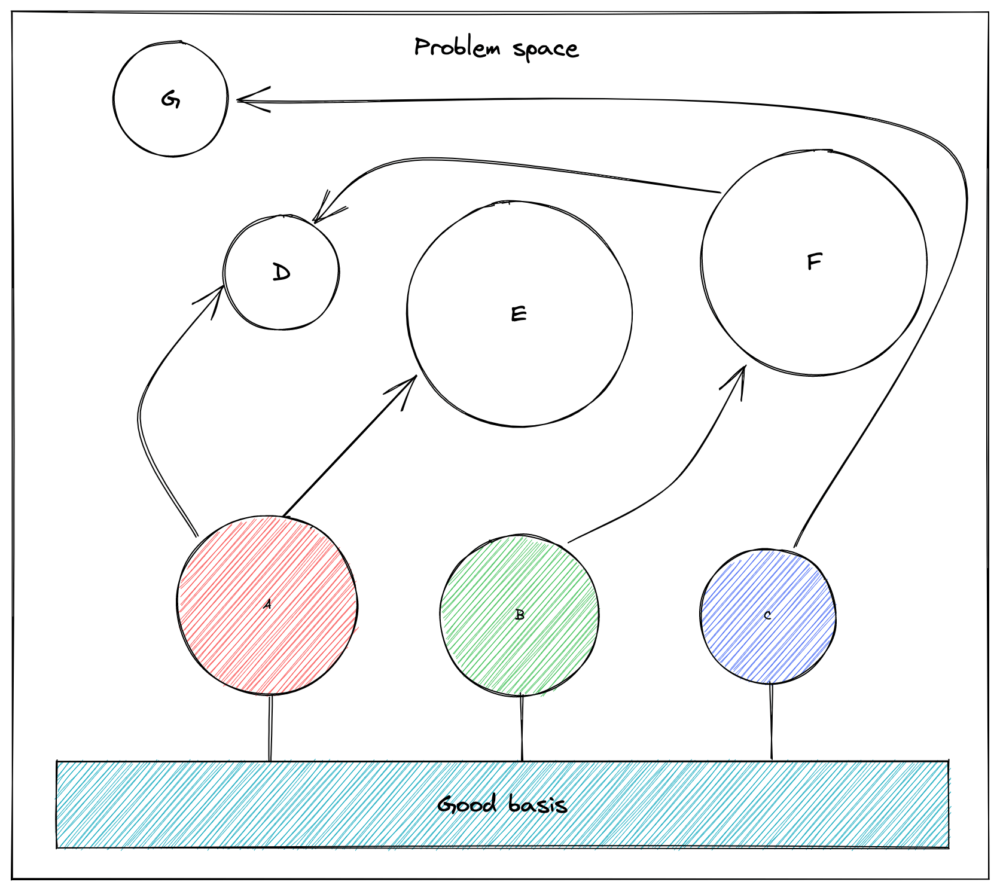
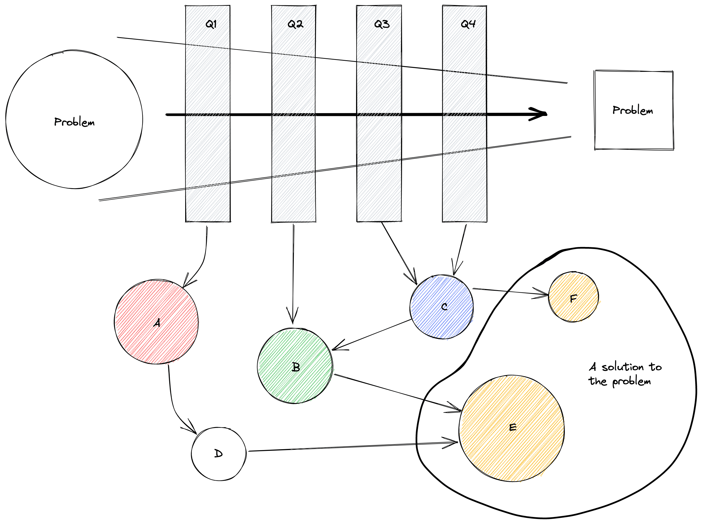

Have you ever noticed the more experience you gain, the more often you can't answer some questions straight away?
Have you ever caught yourself starting an answer with "it depends"?
Again and again?
Me too.

But why does this happen?
Let's think about it.

## Somewhere in the beginning

When you are at the beginning of your professional growth, classify as "junior" your world is shiny and bright.
You only know about things **A**, **B** and **C**, feel fine and fulfilled.

You are very excited about learning these things and at some point, you know the answers to all of your questions and your world looks like this.

You start to face some challenges and to solve them, start to dig deeper in some space.
By doing this you learn new things, expand your horizon in the specific area of your expertise.

At this point, your world starts to morph.

## Gaining experience in-depth

Area **A** becomes bolder (deeper), maybe a little bit wider.
You haven't looked into other areas, so they are still in the same shape and size.

You feel confident, you know a lot of things about **A**.
The whole world is at your fingertips because you think you are an expert.

And something unexpected happens.
You can't solve some problem only with **A**.
Somebody recommends you to look at **B**.
Your world starts to look like this.

"Oooh, I never thought about that".

At this moment you learned to solve problems using new tools/techniques.
Your view angle expanded because of additional perspective added into your view.

"Aha!" moment happens and you understand that everything is connected.

But even if you know a lot of stuff at this point in a specific area, you start to realise that problem space is bigger than you thought initially.

## Good basis

Even though you have pretty large expertise in different areas, you can't know everything.
It's impossible, there are too many things happening.
See that new star in the sky?
It's a new JavaScript framework which will become popular and everyone will speak about it in the following months.

And then suddenly you wake up at night and whisper
"Wait a minute.
All these problems can be solved if you have a good basis.
I already have enough experience in different areas which will help me find a solution in any area out there.
And to solve them better, I need to define constraints".

## Asking questions

Somewhere here you start to ask questions before solving problems.
You try to understand what is needed, what problems try to be solved.

And that's why "It depends".
Because you look at the problem, ask questions, and the solution graph start to appear in the head.
This is a graph by which an optimal solution will be found in the end.

As described [in this article]()
you will be able to find an optimal solution but not always from the beginning.
It's like passing a problem through the filter.
Each question will give a new shape to a problem, more clues to you on how to solve it and eventually a solution will be shaped.

## Summary

- While problem space is small all problems look like nails and you have a hammer
- When problem space starts to expand you understand that not all problems can be solved with one hammer.
You need other tools/techniques for different types of problems
- Finally, before giving something out you define constraints and shape the problem.
This is where "It depends" steps in.
