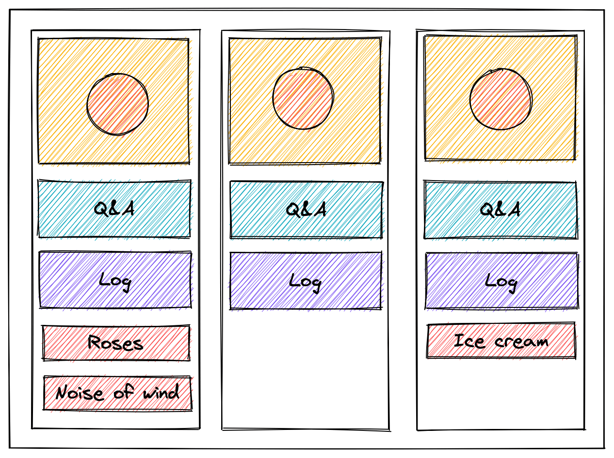
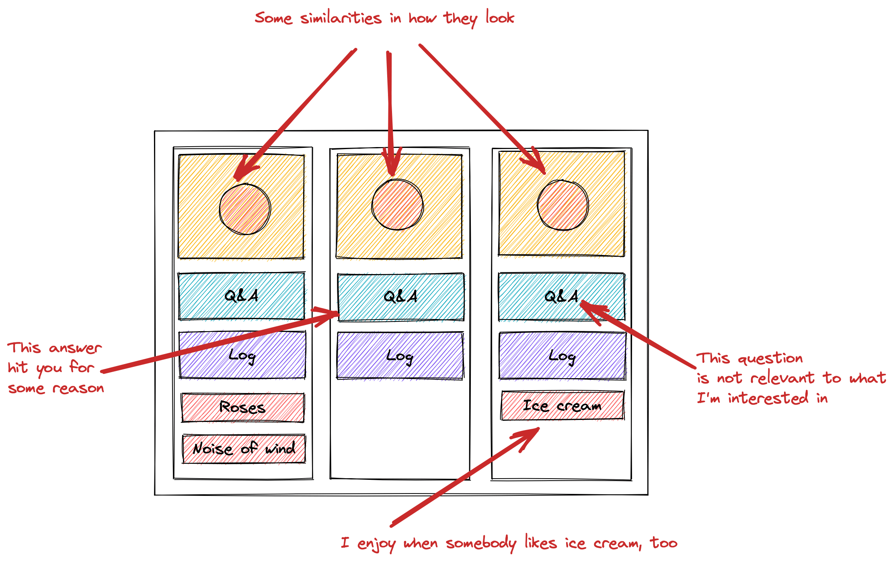

Today is the day when people go on dates, confess in love and do various romantic things.

In this post I'll share my dating experience, thoughts, tips and learnings collected on a journey of ~3 years, approximately.

> **WARNING!**
> Suggestions, learnings shared might not work for you.
> Think three times before applying.

## Statistics

Before diving deeper, some very approximate numbers extrapolated from data which I have on hands:

* 50K profiles swiped
* 500K messages sent
* 250 matches
* 90 dates
* 6 dates abroad
* 5 nationalities
* On average 1 date per person
* Longest streak to build great romantic relationships --- 11 months
* 3 dates on average are needed to get to the first kiss
* 3 very promising attempts to build something great and long lasting
* 4 dating apps tried

## Entering the market

I've entered the dating world after very long relationships.
After a long break, not straight away.
And entered it without any strategy.
Anything. Just to try out what it is, how it is.

After a few dates I was a little bit frustrated because I didn't like how things were going and wanted to.
I started to think about how to make the experience better and to get where I want to and meet the people I want.

## The framework

To be successful in dating you need to know what you want. Seems logical and obvious but how to figure out what you want? You think that you know, but is it true? The answer is --- asking yourself questions, analyzing, reflecting and adjusting. (Looks like Scrum, huh?)

### Describe the persona

I recommend sitting somewhere, in a safe place with no distraction for 30 minutes with pen and paper, and try to describe the person YOU would like to meet and build relationships with.
Limiting time in this exercise is *VERY* important.
Try to describe the person in detail as much as possible. Some questions to enable your imagination:

* Should a person be younger, older, or the same age?
* What hair and eye color?
* Smoker / non-smoker?
* Dominant / Sub?
* Mole on the body?
* What is a person's favorite song?
* Education?
* Favorite painter?
* Favorite food?
* Nationality?
* Dancer?
* Should a person share a hobby with you?

Stop here, don't read below.
Do the exercise.

Good.

Now ask yourself --- "Are you worth the person you described?".
If the answer is yes --- perfect! If it's no --- don't panic.
Answer "Why not?" question.
You will identify your personal growth points, but this should not stop you from pursuing what you want.
Answers are lights which will guide you in the correct direction.

### Catch the patterns

People are not rational species.
Even if you described the persona, highly likely, going on the next date, you will choose people unconsciously again and again, and again.
If you want to be more conscious, you need to catch patterns of your mind and reprogram them to fit your true wishes.

To do so, I've created a table in Trello, where each list is a person I'm dating / starting a conversation with.

It looked something like this:

There are following main cards in each list:

* Picture --- profile picture of the person.
Can be part of the Log card.
* Log --- your diary with that person.
Capture what good happens, what you liked or disliked at any moment.
Save cute messages and compliments.
Save what's been bothering you.
Your personal story with that person.
* Questions & Answers --- special card, will talk about it later.

Other cards are cards describing some person's features.
I'm not good at memorizing everything, so I prefer to write down details like favorite color, flowers, movies, books, quotes, size of clothes, etc. and tag those.

OK, now to the Questions & Answers card.
Time is a valuable resource and we would like to save it as much as possible.
The goal of this card is to identify the person as not fit for you as early as possible.
Because why waste time?

This card and questions on it are the same across all lists.
Questions are dependent on the persona described and what you are searching for.
For example, you want to be with a person who is non-smoker. Question might be "Do you smoke?".

If the answer is "yes", then you stop right here.
That's all.

Sit and think about what you want to ask. Write the questions down.
Remember, asking questions is better than none in any life situation.
Keep the inner voice silent which is telling "oh, this question is stupid" because there are no stupid questions.
If you want to, ask, because the answer is important to *YOU*.

The list of questions might become big.
Prioritize it. Don't ask them all at once.
Wire them into the natural conversation.
You will adjust the questions when you start using them. Listen to the person.
Some questions might be answered during the conversation without asking the questions explicitly.

### Analyze

From time to time stop and analyze what you observe.

How similar are the people you chose?
Do you like it? Do you want to change something?

Priorities changed?
You found that some qualities are very important to you and some are not?
Write them down and adjust questions.

With more and more dates, conversations, you will understand what you want better and gather more information about yourself.

### Reflect

After the board analysis, sit and think about why you chose such people.
How far are they from the persona you described? Maybe help from a specialist in psychology will be needed to get to the roots and eliminate them.
Don't ignore the red flags or something that is not clear to you.
Better to work this through and raise the quality of your life.
This is what we aim for with dating, right? Find someone to make your life richer, not to destroy it.
Right?
Right?

## Learnings

With all of the above, what have I learned?

* For the majority, height matters. Even slight differences in it.
* Majority try to find a way to become addicted to you.
There are not so many people who would like to have true healthy relationships.
* Be yourself.
There are expectations from the other side.
Fuck them, don't try to fit them. You want to be in good, fulfilling relationships, right?
If somebody wants to change you to fit their expectations --- consider this as a big red flag and run.
* If you don't have hobbies, don't worry.
Hobbies are a good addition to conversation to make a little bit of "wow" effect, show yourself and that's all.
In the long run this is not something that will help you to "win".
Maybe, if one of the priorities is that you would like to share those hobbies.
* Nobody asks "how much money you make".
* How many people like to manipulate, omg.
Be careful.
* Listen carefully.
* Dating depends on culture.
For example, there is 14th February and 8th March in my culture, two days where it is expected that men will give flowers (or something else) to women.
And this might not be driven by your will.
Cultural expectations are hard to avoid and be broken.
Sometimes it is needed to play the game by the rules created before you joined this world.
* Contributions to dating should be equivalent.
Scales should move in a low frequency range.
* Relationships with right personas will flow naturally, like a river through the mountains.
* Read the book "The Five Love Languages".
It's worth the time investment.
* Any relationship will die without money.
Oh, this cruel world.
* Nobody is looking for sex, but everyone is looking for the special connection.
* People want to find the romantic partner of life quicker and faster than going through 5 hard interviews for a job in one company.
* You need to learn the skill of "letting go" easily.
* Speak.
We forget to sit and speak about everything.
But it's important for healthy relationships.
* Share problems and ask for help.
You are there both to help each other too.
Believe me, some problems can be solved within minutes with the help of others.

## Conclusion

Dating is an interesting activity.
You meet various people, accept different points of views, and learn a lot.
You adjust yourself because you start to understand yourself better.
You definitely grow.

You should be grateful for every person you've met.
Because each one opens, shows and teaches you something new.

Being more conscious raises your chances to be with someone you truly wish.

This activity has a lot of similarities with investment.
So, if you plan to invest in something, dating might become very good place to learn how it is done.

Be open to opportunities and they will find you.

Wish you luck in your endeavors and find who you truly wish and deserve.
Remember, that it will take time.
