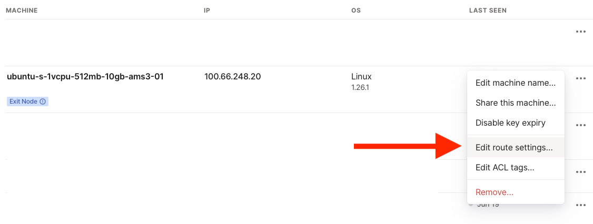
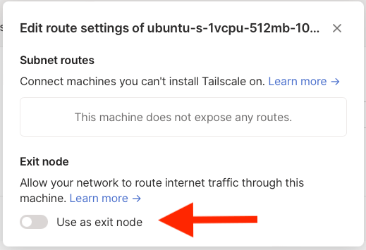

If you haven't yet tried [Tailscale](https://tailscale.com) yet, I highly recommend to do it.
In this short post I'll show how you can easily start your own VPN on DigitalOcean Droplet with help of Tailscale.

## Motivation

I had a need to create a VPN to view some resources as not from my real location.
For my use case I needed to build something on my own because paid solutions didn't work for that use case.

The first thing which came to my mind was OpenVPN.
But have you seen how complex is to setup OpenVPN and make everything to work?

For example, there is a [great tutorial on DigitalOcean website](https://www.digitalocean.com/community/tutorials/how-to-set-up-and-configure-an-openvpn-server-on-ubuntu-20-04)
on how to setup OpenVPN server.
This tutorial consists of **12 steps**.
So many steps to spin-off some piece of software which will forward your traffic from that node to the world.

For me 12 steps is a lot.
I wanted something simpler that would give me the same result.

I remembered about Tailscale.
It promotes itself as VPN (but actually is something bigger), simple to setup, should solve the same problem but faster. Let's give it a try.

## Goal

Tunnel, through which I would be able to connect to some resources as I'm from some specific location.

## Steps

With DigitalOcean it's can be done in 3 steps.

### Step 1: Create a Droplet

Firstly, [create a Droplet](https://cloud.digitalocean.com/droplets/new) of whatever size you want.

I've went with `ubuntu-22-04-x64` and size `s-1vcpu-1gb` and cheapest one.

Select region.
I've chosen `ams3`.

Click "Create".

Now you should see the droplet created.
Log into it via SSH.

### Step 2: Install Tailscale

Refer to the Tailscale documentation on [how to download needed software](https://tailscale.com/download/linux/ubuntu-2204).

TLDR: you need to do the following in the droplet:

```bash
curl -fsSL https://pkgs.tailscale.com/stable/ubuntu/jammy.noarmor.gpg | sudo tee /usr/share/keyrings/tailscale-archive-keyring.gpg >/dev/null
curl -fsSL https://pkgs.tailscale.com/stable/ubuntu/jammy.tailscale-keyring.list | sudo tee /etc/apt/sources.list.d/tailscale.list

sudo apt-get update
sudo apt-get install tailscale -y
echo 'net.ipv4.ip_forward = 1' | sudo tee -a /etc/sysctl.conf
echo 'net.ipv6.conf.all.forwarding = 1' | sudo tee -a /etc/sysctl.conf
sudo sysctl -p /etc/sysctl.conf

sudo tailscale up --advertise-exit-node
```

As you can see, we added `--advertise-exit-node` flag because to route all traffic through some specific node, Tailscale needs to know that node can be used for such purpose.
Additional information on [exit node configuration can be found in their Knowledge Base](https://tailscale.com/kb/1103/exit-nodes/#configuring-an-exit-node).

When you run `tailscale up` it will ask you to login, do this.

### Step 3: Edit route settings

Now, go the [Tailscale Dashboard](https://login.tailscale.com/admin/machines) and adjust the route settings for newly created machine (node).



Now you need to flip the "Use as exit node" switch.

With command `tailscale up --advertise-exit-node` we registered node as "exit node" but in the dashboard we confirmed our intentions.



Bonus points!
If you do not want to re-auth the node manually after key expiration, you can click on three dots again and select "Disable key expiry".

And all done!

Now on different Tailscale machine (your PC, Mac, Phone, etc.) you can select this machine as "Exit node" (menu item title) and it will work as VPN!

You will be able to observer that you are now connected not from your location but from Amsterdam.

### Bonus step

All of this is good and it works, but let's do some hardening around Firewall.

Go to the [Networking > Firewalls](https://cloud.digitalocean.com/networking/firewalls) in the DigitalOcean console and click "Create Firewall".

1. Name it as you wish
1. Delete all inbound rules
1. Create custom inbound rule: protocol `UDP`, port `3478`, sources `100.64.0.0/10`
1. And another custom inbound rule: protocol `UDP`, port `41641`, sources `100.64.0.0/10`
1. In "Apply to Droplets" select your droplet

With this we created Firewall rule which will only accept traffic from Tailscale network.

You will not be able to connect to the machine via SSH using normal IP.
But you will be able to SSH over Tailscale IP.

```bash
# This will fail (DigitalOcean IP)
ssh user@159.223.5.106

# but this will work (Tailscale IP with tailscale running, IP might be different)
ssh user@100.66.248.20
```

More details can be found in [Tailscale FAQ](https://tailscale.com/kb/1082/firewall-ports/).

## Recap

So, that's it.
No complex configuration, no certificates, no copy pasting of files.
Just install, tell what you want and go.

If you want to take a look at some automated example, you can look [into this repo](https://github.com/skibish/terraform-digitalocean-tailscale-exit-node).
It's Terraform based.
Please note that this is not production ready example, use at your own risk.
