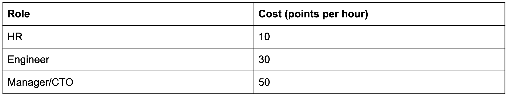
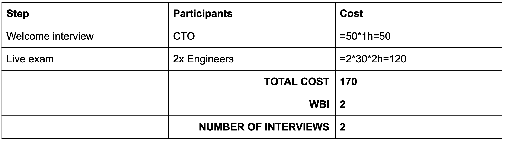
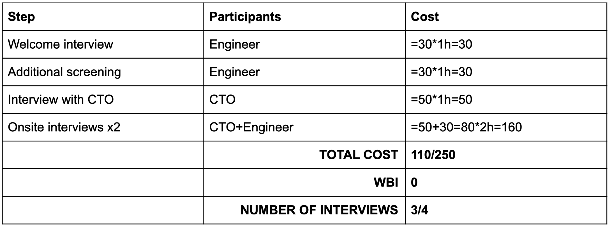

If, by any chance, a comprehensive analysis of interview processes already exists somewhere on the internet, then this is the next best thing.
Just kidding.
Essentially, this is a collection of notes I wrote to myself that describe the interview processes I have encountered so far, the good and the bad.
The idea was that if I ever need to develop an interview strategy again, a cursory glance through this document will refresh my memory.

So why am I writing an article? Throughout my career I have been involved in many interviews, both as an interviewee and an interviewer.
More than 200 interviews conducted, and counting, to be precise.
Eventually, I started to look at the interviews from a different perspective, a process perspective.
I began to analyze the hiring strategies that exist in IT and tried to boil them all down to a single better approach.

So far, I have not found that overall perfect solution, but I can guide you through the interview processes that are practiced today, their
benefits and drawbacks.

I will not be mentioning FAANG companies due to the sheer number of books and articles that have already covered them.
Plus, to be completely honest, out of the Big Five my experience is limited to Google.

Let's dive in!

## Classification

Almost every company invents an interview process from scratch.
And this is a good thing, because every company is looking for something special.
There are, however, companies that invent processes for the sake of having processes.
We're all familiar with those.
As well as the copy-cats, who implement someone else's interview process because "it works for them".

After having an in-depth look at the hiring strategies I have personally witnessed, I realized that the interview process appears to be tightly tied to the general level the company is operating on.
In other words, the interview reflects the company's level of maturity.

Having this in mind, I identified two categories:

1. Adolescent companies
2. Adult companies

Adolescence is the period between childhood and adulthood.
The companies that fall under this category are startups and businesses that focus on the "trendy" aspects of the working environment.
The implicated message is that working under their brand is a highly sought after trophy that needs to be earned.
An interview in an adolescent company is comparable to a rite of passage into the "gang".

Adulthood is the period when both physical and intellectual maturity is in its prime.
The companies that fall under this category are well-established brands that have been on the market long enough to know exactly what they need in a candidate, how to sift through the resumes to find the right person and what to offer to convince them to join.

## Comparison

Before the actual comparison, I would like to introduce a couple of metrics this analysis will focus on.

The first metric is cost.

How much does the interview process cost to a company?
We can make certain assumptions based on the employees involved in the process:



Unsurprisingly, lower cost is preferred, so less points is better.

Another metric is the number of whiteboard interviews (this includes live coding) --- WBI.
This is the most stressful part of the interview.
The risk to fail is at its peak both for the candidate and the company, so less points is better.

The final metric is the number of interviews.
Long-winded interview processes lower motivation of both parties, increase costs and result in exhaustion all around.
So, once again, less points is better.

Now we are ready to dive deeper!

## 1. Adolescence companies

There's a curious trend I observed.
Many companies that are experiencing growth and are in desperate need of good people to "get things done", choose the most complicated multi-step interview process.
I do understand that this is a convenient way to absorb money.
And it's true that a young company can benefit from projecting a certain "cool" image that can be sold to their potential candidates.
But all things considered, this strategy often ends up doing more harm than good.
In my opinion, the interview process in the majority of adolescent companies is over-engineered.

Let's take a look at the following real-life processes:

### 1.1. Process


During this process, the candidates need to face three main challenges:

- Homework;
- Interview with developers (not related to homework);
- On-site whiteboard interview (multiple).

The main question I'm seeing here is: why was homework not enough?
When you hire an engineer, the quality of their homework and a thorough discussion based on it is usually enough to understand their potential.

Another questionable choice is having a separate interview with the CTO.
When a company is just starting out, and the CTO is one of the two employees, it can be beneficial.
For a company with over a 100 people, however, an interview with the CTO is redundant.
So why is it there? I see no valid reason for having it other than to go "Hey, you had the privilege of talking to the CTO! You have now been blessed."

The worst thing about a multi-layered process like this one is that it involves too many people and too many interviews.
Best case scenario is having two interviews a month.
Which means that even when everything goes according to a plan, it takes at least three months to receive an offer.
Naturally, this is bad for the candidate, because they experience stress over a longer period of time.
But this is just as bad for the company, because chances are high that a good candidate will be quickly hired by someone else.

### 1.2. Process


This process is an extension of the previous example.
I catch myself thinking that this is a process for the sake of a process with no actual understanding of the process.

The candidate receives a coding challenge and comes up with a solution.
If their solution is valid, they are invited to a live coding challenge.
But what is the point of doing this?
The candidate has already proven their ability to tackle a problem.
A double-check?
Why???

Similar cost, more stress, a lot of interviews.
Hard to say what their end goal is.

Another trend I have not yet mentioned that is typical for these types of interviews is popping the salary question before the final interview.
True, everyone tries to gauge the salary as soon as possible (do not reveal the number too early) and this example is no exception.
In this case, however, the question will be raised one more time regardless of
whether it was discussed earlier.
This is the point where the company can lose a candidate.
The company has already invested a lot, so why ask the question? Push till the end and negotiate the final offer.

### 1.3. Process


This one is interesting.
It involves personality tests.
This is something I found to be popular in Scandinavian countries.
They try to understand what the candidate's soft skills are and how they fit in with the corporate culture.
I would say this is smart! An engineer may often need to communicate rather than write code.
But it may seem strange from the perspective of a candidate to receive a link to a test that focuses on their personality.
It may be better to evaluate these skills in person and incorporate such questions into the interview, where they can be easily passed off as conversation.

Another interesting aspect of this process is that both of the "screening" interviews are just conversations.
This is fantastic!
A comprehensive conversation is the single best way for the company and the candidate to get to know each other.

### 1.4. Process




Calling this an exam is not an exaggeration.
From my personal experience, I can attest that it was, indeed, an intense exam.
It was a "whiteboard" challenge (the whiteboard being a blank Google Docs) that consisted of such topics as Java programming, SQL queries, JavaScript, HTML semantics, CSS rules, Docker, Kubernetes, Ansible and a couple of others I can no longer remember.
Crazy, huh?
Two hours of stress where you slowly begin to realize that this must be one of those companies looking for "superheroes" and "rockstars".

This type of interview is characterized by an extremely critical approach.
"I don't remember the semantics of the command, but the answer is A" is a failed answer, regardless of whether you answered correctly or not, because expressing doubt is something these guys do not tolerate.

I would recommend avoiding such companies, because they tend to treat people as a resource.
While the prospect of having a lot of hands-on experience is tempting, the prospect of burnout is much more likely in this type of company.

### 1.5. Process


I would place them in the middle.
Technically, this company is mature enough to fall under the adult category.
However, despite being well-established, they focus on hiring students, so they need to project some of that young "adolescent" energy.
Which is what got them into this category.

After every interview the candidate receives a call with feedback on their performance and, if they did well, an invitation to the next round of interviews.
This is a nice trick to keep the candidates interested.
Providing feedback to every candidate is an impressive move.
And calling every one of them personally is even more impressive.
However, there is a downside to this personalized feedback loop --- the interview process can take as much as half a year, or more.
While this may work well for students, a more experienced candidate is likely to find the number of calls and the drawn-out process annoying.

## 2. Adult companies

### 2.1. Process


Here is an innovative approach from a Scandinavian country.
After the welcome interview, the candidate is given homework in the form of a quiz.
The quiz consists of a number of tasks that cover the areas the company is interested in.
A typical quiz includes code review, API design, test writing and integration with API.

After receiving a completed quiz, the company has a more or less clear idea of who the candidate is and how they think.
The only thing left to check is whether the candidate fits in well with the culture during the final interview.

### 2.2. Process


Here is another quiz-based approach. Notice the absence of on-site interviews, which saves the company a ton of money.
And no live coding.
No! Live! Coding! See? It's possible :)

### 2.3. Process




This one is almost unbelievable.
Once again, no live coding.
What's even more interesting is that the process almost entirely consists of conversations.
The interviews are used as a platform to talk, share experience and get to know each other.
The on-site interview includes a design exercise.
This is a welcoming and comfortable atmosphere that underlines the idea that the company is looking for a teammate.

The only drawback is that the interview process can be abruptly cut short after a conversation with the CTO (110 points).

Cheap. Open. Builds trust. A very cool experience.
But to benefit from this type of interview process, the company truly needs to know what they are looking for in a candidate.

### 2.4. Process


A nice and short interview experience.
Live coding is less stressful because the candidate is allowed to google.
Which is an awesome idea, by the way!
In this case as well, both interviews mostly involve conversations.

## Summary


After going through 9 different processes, we can conclude that 4 rounds of interviews are conducted on average.
One round usually involves a whiteboard or a live coding challenge.
It approximately costs 252.2 points to hire a single candidate.

There are exceptional cases, where the number of rounds is 3 or less.
This result is related to the maturity of the companies.
They knew what they were looking for and this allowed them to optimize the process, lower the cost and achieve a higher final result.

To anybody looking to improve their interview results, I suggest to map out the interview process and reconsider some of the stages.
Think about what can be removed to minimize the cost and the stress and maximize the gains.

### Good

**It's good when the process is short.**
The interview details stay fresh in the memory of all parties involved.
In this case, providing valuable feedback is crucial.
The candidates want to know what they can improve and what their weak points are.
Giving feedback elevates the company's status in the eyes of their future employees and encourages team spirit.
So fear not to show the candidates that you care.

**Talk more, encourage discussions.**
Ask yourself more often whether you'd want to hang out outside of work with the person you are interviewing.
Would you go for a beer with them?
Are they comfortable to be around?
If the answer is yes --- give them an extra chance.

**Be nice, respect your candidate.**
It pays to remember that the candidate is a specialist who may one day become your teammate.
Treat them accordingly, be polite and respectful.

**Make your candidates feel safe and comfortable.**
An underrated aspect of the interview.
You will not be able to truly figure the person out until they are comfortable.
This is why informal conversations are so important.
It may be a good idea to start the interview off with questions unrelated to work.
Ask the candidate what their hobby is, or whether they watched that final episode of the show everyone loves.
Start on a friendly note and watch their true potential unfold.

### Bad

**Whiteboard / live coding interviews.**
To be honest, I believe live coding challenges provide next to no valuable information.
Much like a university exam, a test like this doesn't completely reflect the range of the person's skills and knowledge.
Fairly often it only demonstrates the skill of learning basic material overnight.
Instead, assign homework or a quiz that covers needed set of skills.
This is a more informative approach, as it is much closer to a real-life working scenario, where most of the work is performed autonomously and in a more or less comfortable environment.

**Exams.**
Don't do live exams.
You are looking for professionals who want to work and do a good job.
By making them pass an exam, all you are learning about them is how well they can pass an exam.

What can you tell from the following feedback?

> While you have a strong software engineering background, our team would like to interview several other candidates before making a final decision.
> A few areas of improvement: programming problem solving skills, and broader experience across full stack --- including AWS and Kubernetes.

They appear to be looking for three different people, right?
This type of feedback is a definite red flag.

**No feedback and generic response emails.**
Generic copy-pasted responses are a bad choice, because they are too impersonal.

> I would like to note that competition for jobs at \<company\> is very strong, and that we have to make difficult choices between many high-caliber candidates.
> We are starting with a small team. We will be keeping your resume on file for future openings.

Also, don't lie to impress the candidate.
If they didn't do a good job or are unfit for the position --- tell them.
Better yet, provide some valuable feedback in a personalized email.
In our ever-busy world, a timely and well-written email is better than a sudden personal call.

**Forgetting about the candidate.**
Keep track of the interviews and the candidate's progress.
The candidate will be unimpressed if you ask them whether they have attended a certain interview or not.
And for good reason!
This is a very bad look for the company.
If the hiring process is disorganized, it is reasonable to assume that all of the company's processes are just as disorganized.

**Narrow-mindedness.**
I've been in situations where the interviewer makes a final decision based on personal bias.
I'm sure many of you are familiar with this as well.
The most common example would be gender bias.
Features that do not impact the candidate's professional qualities should be free from your judgement.
Be aware of your prejudice and strive for a reasonable unbiased decision.
Remember, that being impartial and open-minded are skills that can be learned and trained.

**Phone on the table.**
Both parties should set their phones aside for the duration of the interview.
If you are using your phone to take notes, inform the candidate of this.
Doing otherwise will show disrespect and a lack of focus.
Pay attention to the candidate during the interview, listen to what they have to say.

With the above-mentioned points in mind, we can move on to the question of what makes a process run smoothly.
Let's create a framework of a good interview process.

### Framework

> "Framework --- a supporting structure around which something can be built.
> A system of rules, ideas, or beliefs that is used to plan or decide something."
> ([source](https://dictionary.cambridge.org/dictionary/english/framework))

I propose the following framework:

1. Choose a transparent for all parties involved.
Make sure all relevant parties are invited.
2. If recruitment is conducted by the HR or an external agency, define the candidate profile (get inspiration from the [customer avatar technique](https://www.einsteinmarketer.com/customer-avatar-target-market/)).
3. Create a list of questions that should be answered during the interview.
Writing down notes for each of the questions will help you to not lose track of the conversation.
    1. Distribute this list among the interviewers.
    2. After each interview, fill in the list with answers provided by the candidate.
    3. The list should include soft skill (personality) questions.
    4. The list should include technical questions.
4. After the interview, write a response to the candidate with relevant feedback, regardless of whether they proceed to the next round or not.
5. If you have homework:
    1. It should be a relatively small task that reflects a real-life working scenario.
    2. All interviewers must be aware of the task and its details.
    3. Create a checklist that should be filled in after the homework task has been checked.
    The checklist should be shared with all people responsible for the homework.
    4. The interview that follows homework *should be a discussion based on said homework.*
6. Interviews should be conducted onsite or via conference calls with the camera enabled.
7. The process should consist of *no more than three steps*.
8. Avoid live coding / whiteboarding challenges.
9. Each interview should be conducted in a one-on-one format.

### Collaboration platform

Personally, I found Trello to be a very convenient tool for constructing the interview process.
The columns can serve as the interview stages.
And the cards can represent the candidates.
The candidate cards can then be assigned to people responsible for them.
This way, everyone can see the candidate's progress.

You can use comments to write reviews after every step.
With additional plugins, you can add a voting button to every card.
This voting system can be used to decide which candidate should be invited to the interview.

Labels can be used to represent additional relevant information.
For example, the source (was the candidate recommended by an agency or is this a referral?).
And by making use of the columns, you can see at a glance how the interview flow works.

#### Candidate profile

I recommend to create a profile based on the following three pillars:

- Technical impression.
Describe what skills you are looking for.
For example: fluent in terminology, has architectural intuition.
- Self-organization.
For example: independent and able to guide teams.
- Communication.
For example: good at explaining concepts and ideas.

#### List of questions

I highly recommend adding some "quiz" questions to your first interview.
Here is a short example of such a question:

```js
// Code review. How does the following function violate good design principles?

function getDepositHistorySum(user) {
  let deposits = user.transactions.history.deposits;
  let sum = 0;
  for (let i = 0; i < deposits.length; i += 1) {
    sum += deposits[i].amount;
  }
  return sum;
}
```

### Conclusion

I hope you enjoyed reading and were inspired to improve the interview process in your company.
Remember to always focus on what you are looking for.
And switch to adult companies ;)

You can also listen to [my talk here](https://www.youtube.com/watch?v=1u5griKyxzc) for additional thoughts on the interview process.

If you want me to help you analyze and improve your interview process, feel free to [contact me](https://sergeykibish.com/).

P.S. By the way, if you are looking for companies that don't practice whiteboard interviews, you will definitely appreciate [this repository](https://github.com/poteto/hiring-without-whiteboards).
